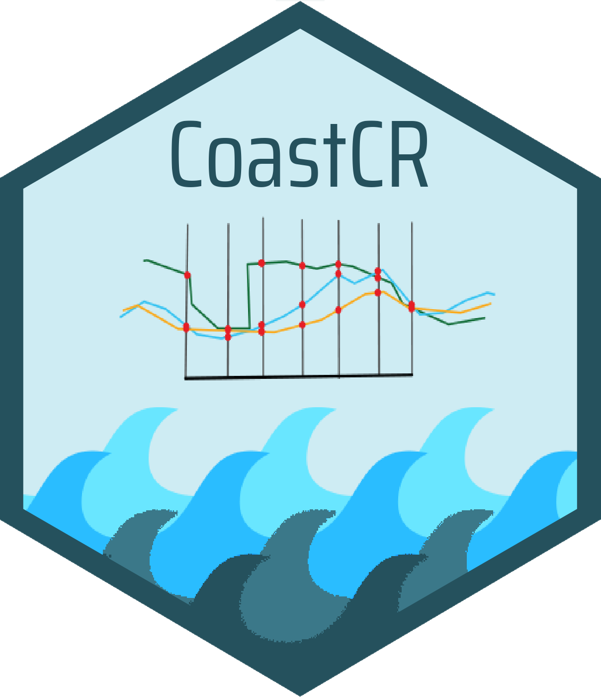

CoastCR 
=========================================================
# `CoastCR`: Coastal Change using R

<!-- badges: start -->
[](https://github.com/alejandro-gomez/CoastCR/actions)
<!-- badges: end -->
  
## Overview

**CoastCR** is an open source package for computing coastal variations. This package needs the intersections between each normal line and each historical coastlines to estimate the annual rates and global variations. This tool is a part of ODSAS (Open Digital Shoreline Analysis System v1.0) and the entire calculation process can be completed using SAGA GIS and CoastCR.

----

Contents:

* [Why this package](#why-this-package)
* [How it works](#how-it-works)
  * [Installation](#installation)
  * [Examples](#examples)
* [Package citation](#package-citation)
* [Authors](#authors)
* [Contact](#contact)

----

## Why this package
The analysis about the coastal variations is a very relevant study field in the coastal research. These studies have a great importance, in the global change context, to understand the coastal modifications and improve the coastal management. This package is intended to be an open-source tool to estimate the variation rates.
In short, `CoastCR` allows to:

-    Compute the **coastal variations** using open-source softwares as SAGA and R. This package estimate the most common variation rates (e.g., NSM, LRR or WLR) from normal transects to a baseline. Two main functions are included in the current version to filter and estimate the parameters:

     - ***Baseline filter***: This function defining the baseline position, in relation to the historical coastlines and filter the intersection points based on the closest intersection for each coastline in each transect.
  
     - ***Coast rates***: This tool estimates the main parameters for each transect in absolute variations and in annual rates. The parameters estimated in this function as:
     
        - **NSM**: Net Shoreline Movement (m).
        - **EPR**: End Point Rate (m yr<sup>-1</sup>).
        - **SCE**: Shoreline Change Envelope (m).
        - **LRR**: Linear Regression Rate (m yr<sup>-1</sup>).
        - **WLR**: Weighted Linear Regression Rate (m yr<sup>-1</sup>).

&nbsp;

- ***Coastline Variations*** is designed to execute the aforementioned functions. First, filters the intersection points and then calculates the variation rates.
        
## How it works

### Installation

``` r
# To install the latest version from Github:
# install.packages("remotes")
remotes::install_github("alejandro-gomez/CoastCR")
```

### Examples

Coming soon!

## Package citation

Using CoastCR for research publication?  Please **cite it**! I'm an early career scientist and every citation matters.

***Gómez-Pazo, A., Payo, A., Paz-Delgado, M.V., Delgadillo-Calzadilla, M.A.***, (*in press*). *Open Digital Shoreline Analysis System: ODSAS v1.0*. Journal of Marine Science and Engineering.

## Authors

Alejandro Gómez-Pazo

M. Victoria Paz-Delgado

Contributors: Andres Payo and M.A. Delgadillo-Calzadilla

## Contact

Alejandro Gómez-Pazo: a.gomez@usc.es
